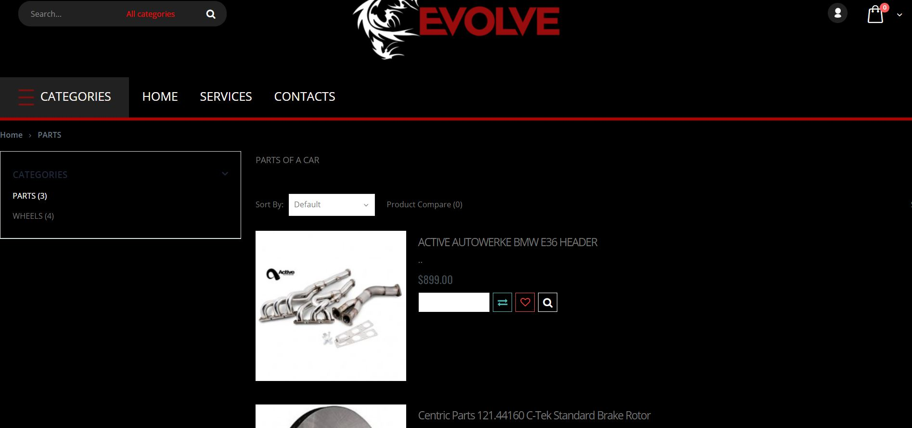

# opencartWebsite
## Introduction 
This is an opencart website i created where I familiarized myself with opencart functionalities, mvc structure and php language.

The opencart project is configured in local with xampp. I designed and coded the layout and the pages of the website
in accordance with the requirements. There are a few sample pages available as well as a couple of sample products and 
categories.

Through this project, I have a preliminary understanding of PHP language, a more in-depth knowledge and practice
of MVC structure and its advantages, as well as opencart functionalities, template, modules, plugin for user. I have also 
gained more versatility of my css, html and jquery skills


## Getting Started

These instructions will get you a copy of the project up and running on your local machine for development and testing purposes. See deployment for notes on how to deploy the project on a live system.

### Prerequisites

What things you need to install the software and how to install them

```
Task 1:install xampp
Task 2:configure xampp and setup sql database in localhost/phpmyadmin
```
### Installing

A step by step series of examples that tell you how to get a development env running

1.clone this repo and install all softwares above

2. set up an opencart project with local configuration

2.In phpmyadmin import the shop.sql file present in the root directory of this project

This is what the website looks like:




